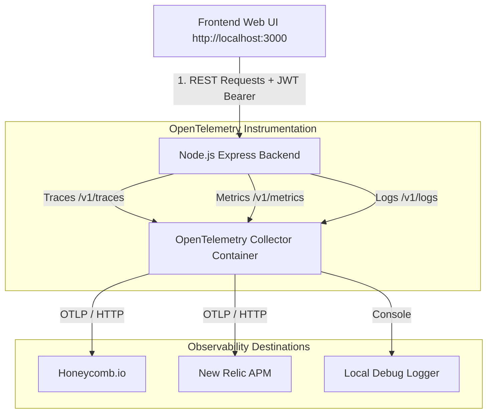

# 🚀 Todo CRUD Service with OpenTelemetry (Honeycomb & New Relic)

A production-ready Todo application built with **Node.js, Express, and modern Glassmorphism Frontend**, fully instrumented with **OpenTelemetry (OTel)** to export **Traces, Metrics, and Logs** simultaneously to both **Honeycomb.io** and **New Relic** using an **OpenTelemetry Collector**.

---

## 🌟 Features

- **Full Observability (3 Pillars)**:
  - 🌐 **Traces**: Auto-instrumented Express HTTP spans + manual spans with custom attributes.
  - 📊 **Metrics**: System process metrics (CPU/Memory) + custom application counters (`todo.created.count`, `todo.deleted.count`).
  - 📝 **Logs**: Correlated structured log records containing `trace_id` and `span_id`.
- **User Identity Context Propagation**:
  - Automatically attaches `user.id` and `user.email` to every OTel trace span so you can slice and filter traces by user in Honeycomb & New Relic.
- **User Authentication & Data Isolation**:
  - User registration & login (JWT authentication + bcrypt password hashing).
  - Isolated workspaces so users only see their own tasks.
- **Dockerized Setup**:
  - `docker-compose.yml` bundling the application and OpenTelemetry Collector container.

---

## 🏗️ System Architecture



---

## 🚀 Quick Start

### 1. Clone & Set Environment Variables
Copy `.env.example` to `.env`:
```bash
cp .env.example .env
```

Edit `.env` to add your Honeycomb & New Relic credentials:
```env
# OpenTelemetry Configuration
OTEL_SERVICE_NAME=todo-backend-service

# Honeycomb API Key (Get from https://ui.honeycomb.io -> Settings -> Environment Keys)
HONEYCOMB_API_KEY=your_honeycomb_api_key_here
HONEYCOMB_DATASET=todo-app-traces

# New Relic License Key (Get from https://one.newrelic.com -> API Keys -> License Key)
NEW_RELIC_LICENSE_KEY=your_newrelic_license_key_here
```

> [!NOTE]
> Make sure there are **no leading spaces** after the `=` sign in your `.env` values.

---

### 2. Launch with Docker Compose
Run the following command to build and start both the application and OpenTelemetry Collector:
```bash
docker compose up --build -d
```

---

### 3. Open the Application
Open your web browser and navigate to:
👉 **[http://localhost:3000](http://localhost:3000)**

- **Pre-seeded Demo User**:
  - **Email**: `demo@example.com`
  - **Password**: `password123`
- Or click **Create Account** to register a new account!

---

### 4. Inspect Telemetry Logs Locally
To view live trace, metric, and log payloads captured by the local OTel Collector:
```bash
docker compose logs -f otel-collector
```

---

## 📡 API Reference

### Auth Endpoints
| Method | Endpoint | Description |
| :--- | :--- | :--- |
| `POST` | `/api/auth/register` | Create a new user account (returns JWT) |
| `POST` | `/api/auth/login` | Authenticate user (returns JWT) |
| `GET` | `/api/auth/me` | Fetch current authenticated profile |

### Todo CRUD Endpoints (Protected)
| Method | Endpoint | Description |
| :--- | :--- | :--- |
| `GET` | `/api/todos` | List todos for current user |
| `POST` | `/api/todos` | Create a new todo |
| `PUT` | `/api/todos/:id` | Update completion status or task details |
| `DELETE` | `/api/todos/:id` | Delete a todo |

### System Telemetry Status
| Method | Endpoint | Description |
| :--- | :--- | :--- |
| `GET` | `/api/telemetry-status` | Returns active OTel signals & cloud destinations status |

---

## 🔍 How to Query in Honeycomb & New Relic

### Honeycomb.io
1. Go to **Query Builder** ➔ Select Dataset `todo-app-traces`.
2. **Filter by User**: Add `WHERE user.email = "demo@example.com"`.
3. **Trace Latency Heatmap**: Run `HEATMAP(duration_ms)` grouped by `http.route`.
4. **Metrics & Logs**: Select **Logs** or **Metrics** tabs in Honeycomb to query correlated logs and CPU/memory metrics.

### New Relic
1. Open **APM & Services** ➔ Select **`todo-backend-service`**.
2. **Distributed Tracing**: View end-to-end request flows and filter by `user.id` or `user.email`.
3. **Metrics Explorer**: Query custom metric `todo.created.count`.
4. **Logs**: View application logs correlated with trace IDs.

---

## 📁 Project Structure

```text
.
├── server.js                 # Express REST API + Auth & OTel instrumentation
├── tracing.js                # OpenTelemetry Node SDK (Traces, Metrics, Logs setup)
├── otel-collector-config.yaml # OTel Collector multi-backend exporter configuration
├── Dockerfile                # Node.js app container definition
├── docker-compose.yml        # Orchestration for App + OTel Collector
├── package.json              # Project dependencies
├── .env                      # Environment configuration
└── public/                   # Frontend Web Application
    ├── index.html            # Dashboard UI & Auth Modal
    ├── styles.css            # Dark Glassmorphic styling
    └── app.js                # Client logic & REST API handlers
```

---

## 🛠️ Useful Commands

```bash
# Restart containers after editing .env
docker compose restart

# Rebuild containers after updating code
docker compose up --build -d

# Stop all running containers
docker compose down
```
